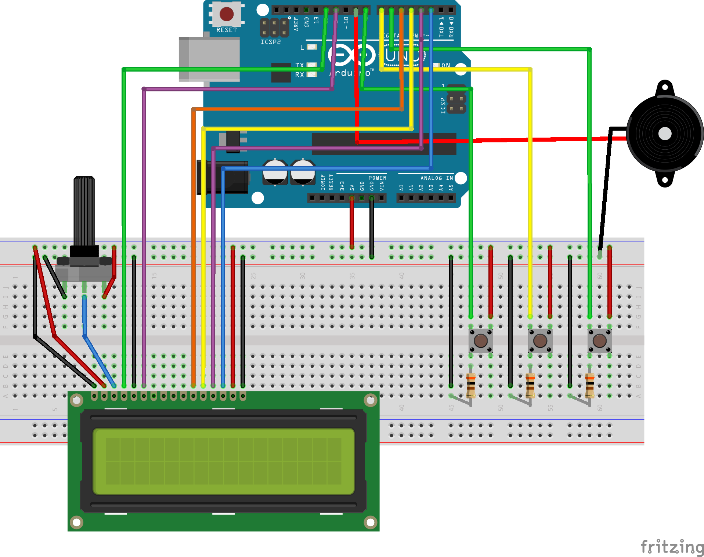

# Mors-Kod-Cevirici
Butondan alınan mors kodunun karşılığı olan harfi lcd ekrana yazdırır. Buzzer aracılığı ile de sese dönüştürür. Bu Arduino projesi üniversite Fizik-II dersi için hazırlanmıştır.

## Şema

## Gerekli bileşenler
* 1 × Arduino Uno
* 27 × Erkek - erkek jumper kablo
* 3 × Push buton
* 1 × Lcd ekran (2 x 16)
* 1 × Buzzer
* 3 × 10k ohm direnç
* 1 × Breadboard
* 1 × 10k potansiyometre

## Kurulum
1. [LiquidCrystal](https://www.arduino.cc/en/Reference/LiquidCrystal) kütüphanesini bilgisayarınıza kurun
2. Bileşenleri şemada gösterildiği gibi takın
3. Kodu Arduino'ya yükleyin

## Kullanım
* Birinci buton: Mors kodunu alır
* İkinci buton: Mors kodunu tanımlar ve karşılığındaki harfi ekrana yazar
* Üçüncü buton: Kelimenin mors kodunu buzzer aracılığı ile sese dönüştürür

## Lisans
[GNU General Public License v3.0](https://choosealicense.com/licenses/gpl-3.0/)