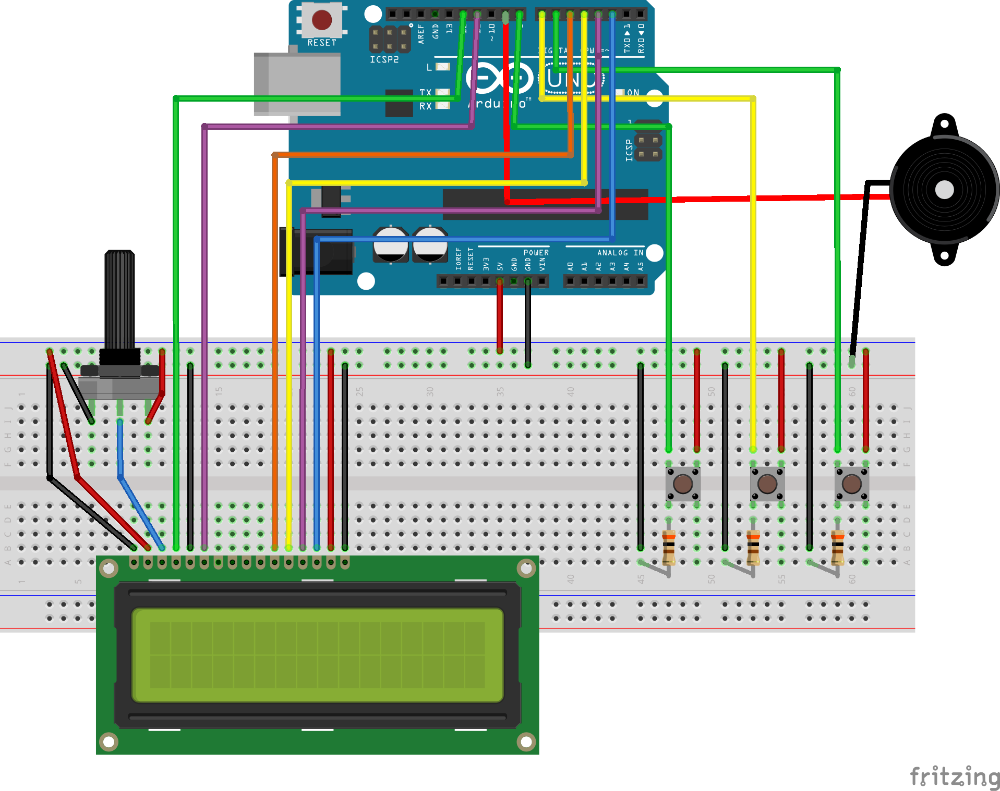

# Mors-Kod-Cevirici
Butondan alınan mors kodunun karşılığı olan harfi lcd ekrana yazdırır. Buzzer aracılığı ile de sese dönüştürür. Bu Arduino projesi üniversite fizik dersi için hazırlanmıştır.

## Şema

## Gerekli bileşenler
* 1 × Arduino
* 27 × Erkek-erkek jumper kablo
* 3 × Push buton
* 1 × Lcd ekran(2x16)
* 1 × Buzzer
* 3 × 10k ohm direnc
* 1 × Breadboard
* 1 × 10k potansiyometre

## Kurulum
1. Bileşenleri şemada gösterildiği gibi takın
2. Kodu Arduino'ya yükleyin

## Kullanım
* Birinci buton: Mors kodunu alır
* İkinci buton: Mors kodunun karşılığındaki harfi ekrana yazar
* Üçüncü buton: Kelimenin mors kodunu buzzer aracılığı ile sese dönüştürür

## Lisans
[GNU General Public License v3.0](https://choosealicense.com/licenses/gpl-3.0/)
